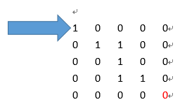
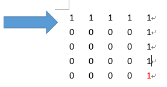

**程式題目：尋找迷宮出口**

1.  **程式介紹**

    1.  實作一個可以判斷迷宮地圖是否有辦法走到出口的程式。

    2.  迷宮地圖最大20 X 20

2.  **程式流程**

    1.  使用者一開始輸入一個數字N，用來告知程式之後輸入的地圖長寬。

    2.  使用者在輸入一個N x N大小的數字矩陣。

    3.  N最大為20

    4.  地圖元素皆由0和1所組成。

    5.  每個元素接用空白或換行隔開。

    6.  0代表不可通行、1代表可通行。

    7.  由程式判斷此張地圖是否能從最左上角[0][0]走到最右下角[N-1][N-1]。

        1.  如果可以則告知**使用者可能走到出口。**

        2.  如果不可以則告知**使用者不可能走到出口。**

**可走出的地圖範例**

**不可走出的地圖範例**

